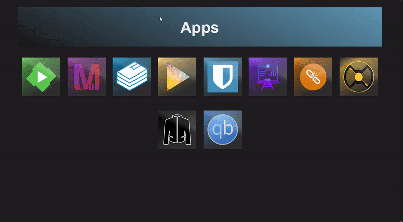

# Services Dashboard

A simple starter page for apps

I made this for my self hosted apps, you can use it for anything

## Preview

## How to install

- Install dependencies with composer.

  `composer install`

  It may complain about missing php libraries, activate them if you haven't already.

- Configure your apps in services.json, put png or jpg images into images folder.

- Copy the folder to your webserver.

- Profit
